# 演员表

《败犬女主太多了！》OP 里的 18 位固定角色全部换成校园 AI 娘；原作的男生也换成穿女生校服的 AI 娘。人设图只决定外观（发型、发色、配饰、校服和蝴蝶结颜色），站位、动作和镜头都跟原片走。

- 同一个原作角色全片只对应一个 AI 娘
- 认不出身份的路人、没有主要人物的镜头（例如 038）不换人
- 人设图全部由 GPT 生图生成，图片和提示词见 [designs/](designs/)。DeepSeek、Gemini、Claude、Kimi、MiniMax、Qwen 的基础形象参考了社区流行的 AI 娘设计（DeepSeek 娘由社区共同完成设计），GPT 和其余 11 位为原创；机器可读的对应表在 [../data/full_plan.json](../data/full_plan.json) 的 `cast` 字段
- “出场镜头”按每个单元最终通过的版本实际使用的参考图统计

## 主要角色

| | 原作角色 | 原作外观 | AI 娘 | AI 娘外观 | 出场镜头 |
|---|---|---|---|---|---|
| 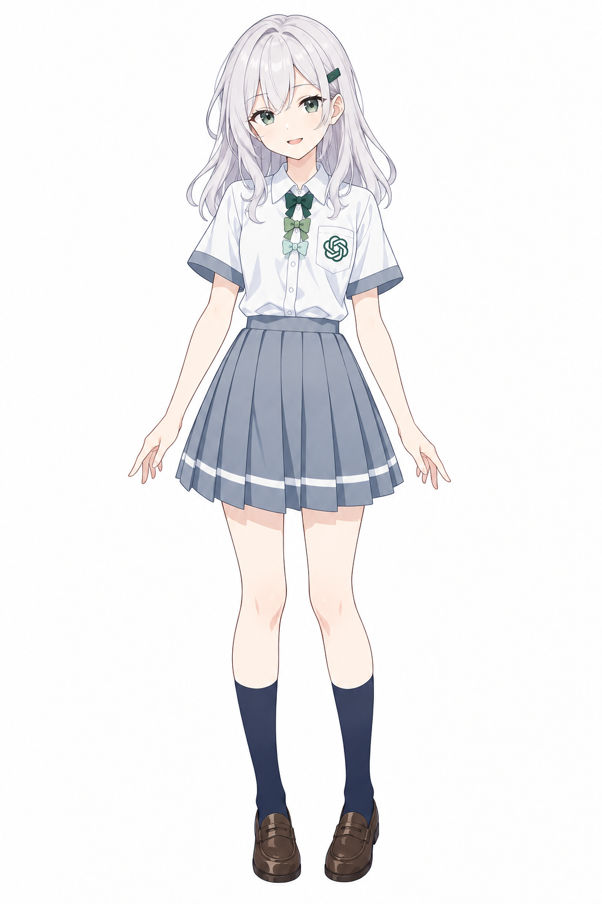 | 温水和彦（男主） | 普通的深色短发男生 | **GPT** | 银白中长发、灰绿眼、绿色蝴蝶结，沉稳可靠（原创人设，不是社区的龙娘形象） | 014_015、016、018、020、021-022、023、032-033、045、046、058 |
| 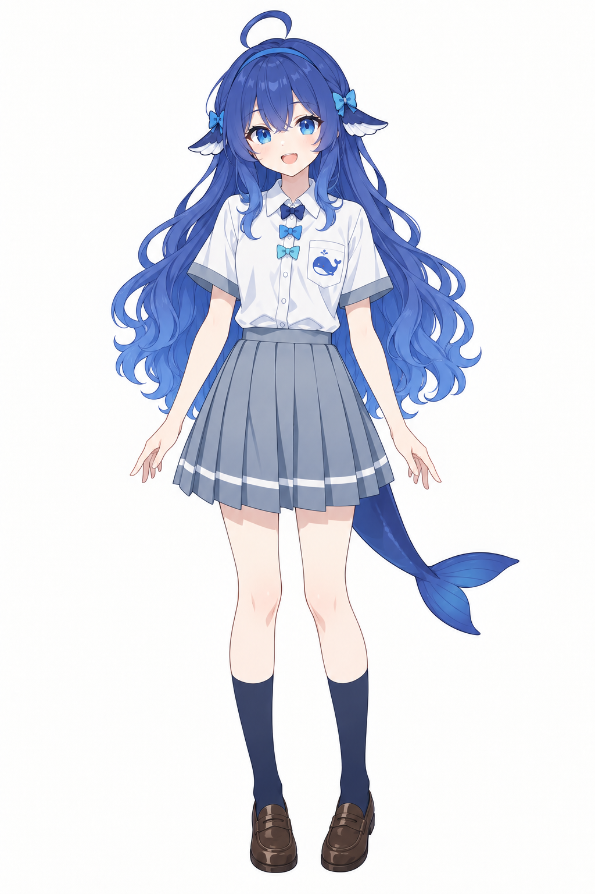 | 八奈见杏菜 | 青蓝色蓬松短发、黄色蝴蝶结 | **DeepSeek** | 深蓝长卷发、圈状呆毛、蓝发箍、小鲸鳍耳、鲸尾、蓝色蝴蝶结 | 002、003、004、017、018、024-026、032-033、041_043、047、048、049-051、052、053、054、058、059、067、068、069、070、074、076-077 |
|  | 烧盐柠檬 | 晒黑肤色、棕色短发、运动型 | **Gemini** | 蓝紫长发发尾渐粉、猫耳、丸子头加星星发夹、一粉一金异色瞳、紫色蓬松猫尾、红黄绿彩色蝴蝶结 | 005、006、007、017、018、024-026、032-033、049-051、052、053、055、058、059、068、069、073、079 |
| 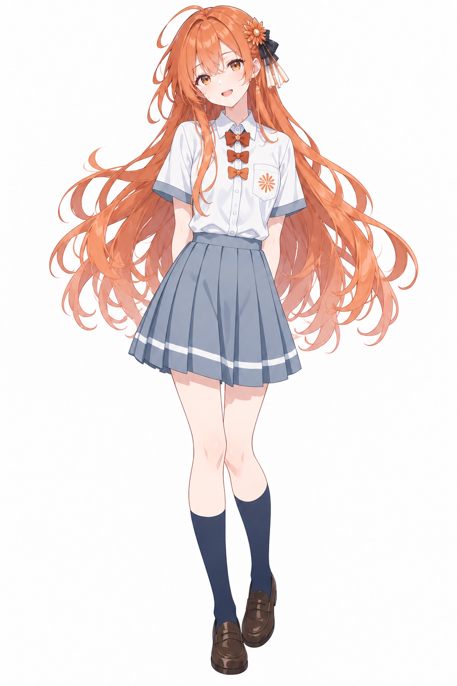 | 小鞠知花 | 娇小、红／赤褐色短发、害羞 | **Claude** | 铜橙色长发、橙色花饰、琥珀色眼睛、橙红蝴蝶结 | 008、009、017、018、028-029、031、032-033、049-051、052、053、056、058、059、069、072、080 |

## 其他角色

| | 原作角色 | 画面里怎么认 | AI 娘 | AI 娘外观 | 出场镜头 |
|---|---|---|---|---|---|
| 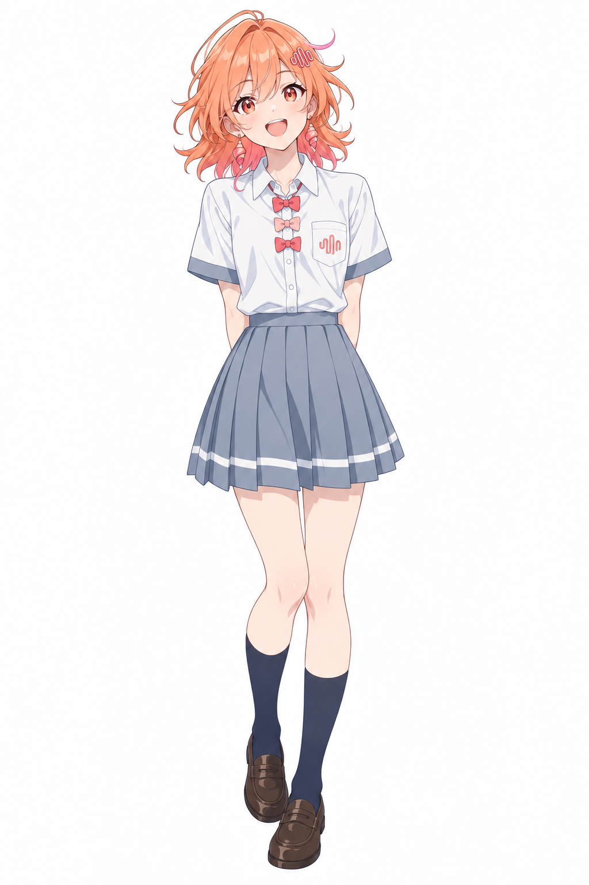 | 温水佳树 | 男主的妹妹，深棕长发、齐刘海 | **MiniMax** | 桃橙色短发、珊瑚色波浪发夹、珊瑚色蝴蝶结 | 036_037、066 |
| 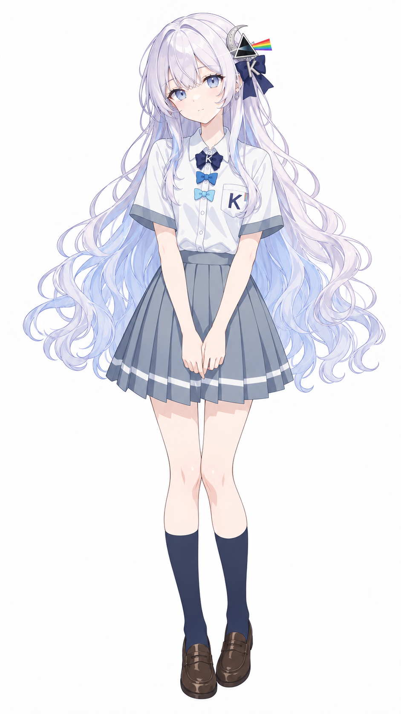 | 姬宫华恋 | 粉紫色长发，和袴田在一起 | **Kimi** | 很长的银薰衣草色长发、蓝眼、月牙／棱镜饰品、藏青与浅蓝蝴蝶结 | 035、061 |
| 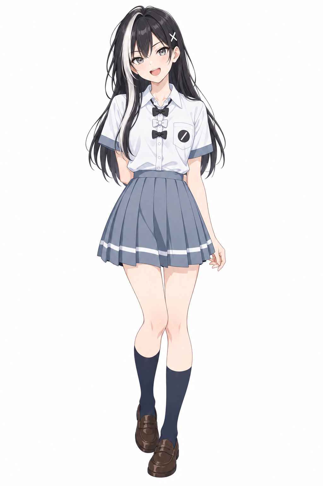 | 袴田草介（男） | 帅气的棕色刺猬头男生 | **Grok** | 黑色长发带宽白挑染、灰眼、X 形发夹、黑白蝴蝶结 | 035、061 |
| 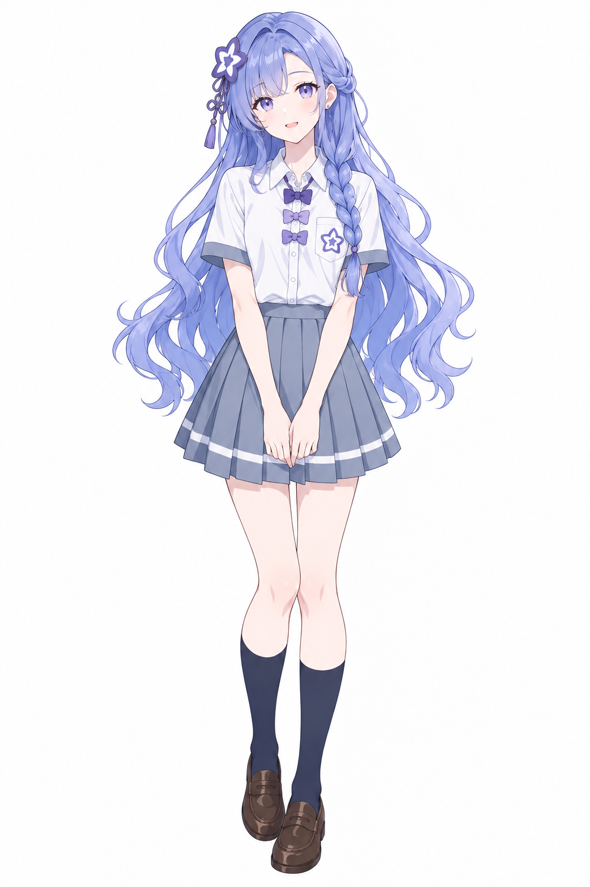 | 朝云千早 | 棕色直长发的女生（035 里穿黄色连衣裙），和绫野在一起 | **Qwen** | 蓝紫长发加侧编辫、紫眼、紫色结形发夹、紫色蝴蝶结 | 034、035、062 |
| 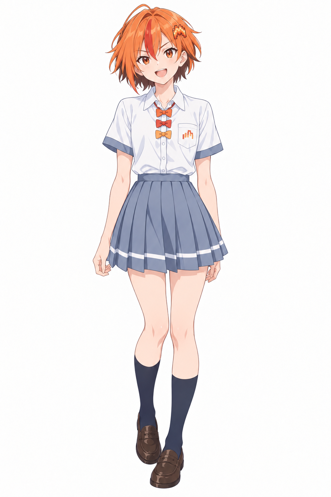 | 绫野光希（男） | 银灰发戴眼镜的男生（035 里穿绿马甲） | **Mistral** | 橙色棱角短波波头、深色内层加红色挑染、琥珀眼、像素 M 发夹、暖橙红蝴蝶结 | 034、035、062 |
| 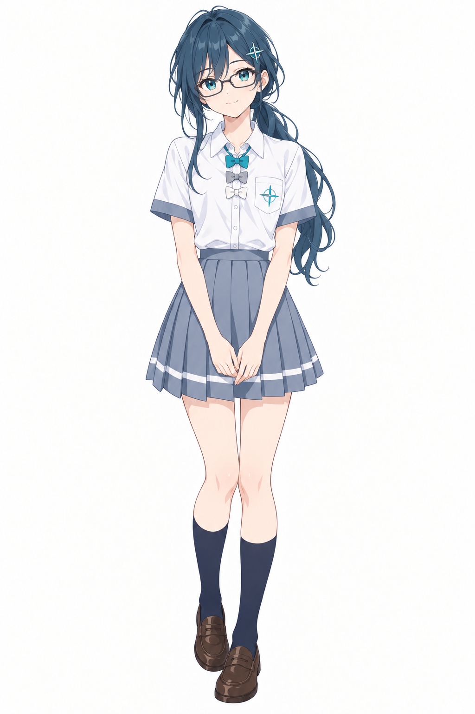 | 月之木古都 | 文艺部高个子学姐，深紫长发、方框眼镜 | **Perplexity** | 深青色低马尾、青色眼、方框眼镜、青灰白蝴蝶结、指南针徽章 | 031、032-033、064 |
| 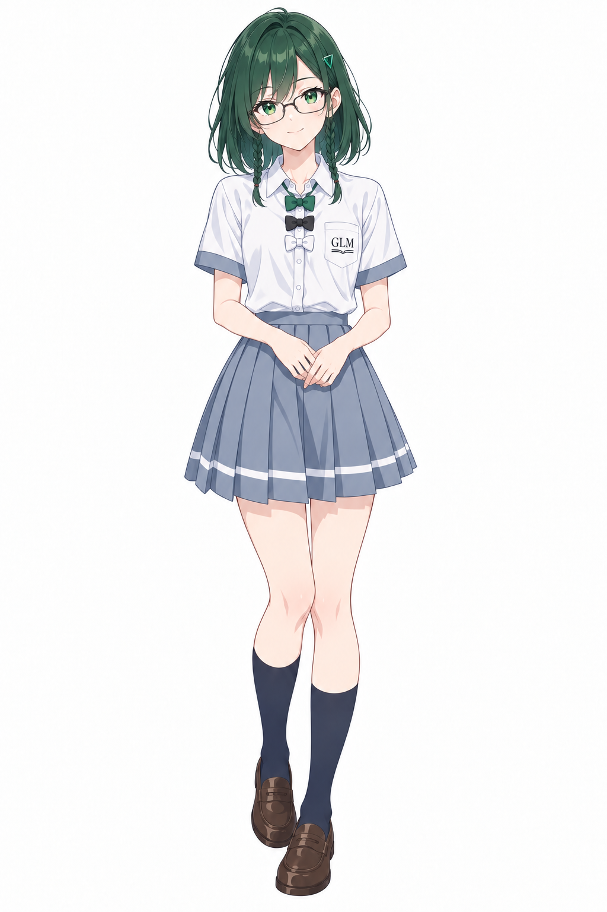 | 玉木慎太郎（男） | 文艺部男生，深绿短发 | **GLM** | 绿色波波头加两条细辫、绿眼、方框眼镜、绿黑白蝴蝶结、GLM 徽章 | 031、032-033、064 |
| 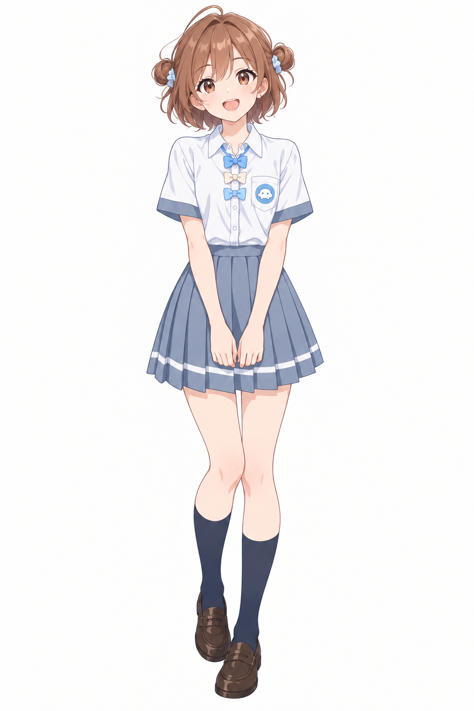 | 甘夏古奈美 | 男主的老师，短棕发、紫色便服 | **豆包** | 棕色波波头加两个小丸子、棕眼、蓝米色蝴蝶结、小豆子徽章 | 039、040、065 |
| 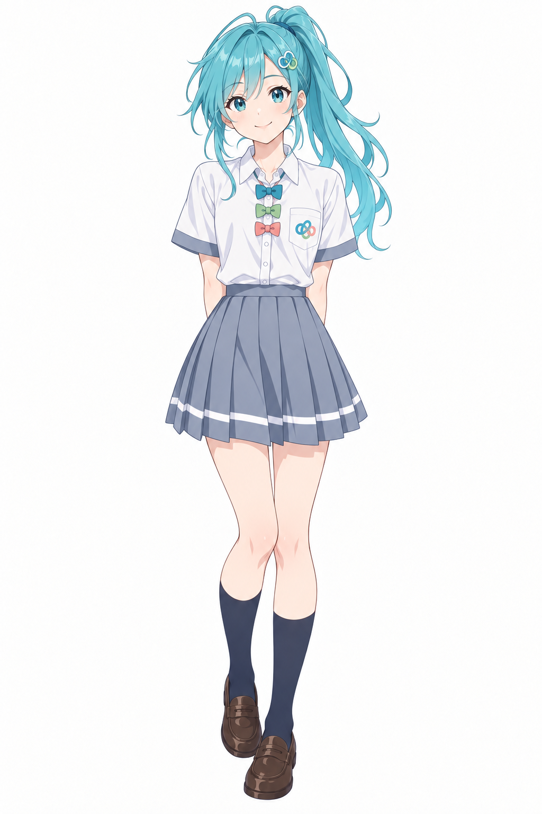 | 小拔小夜 | 高个子老师，浅绿长发 | **Copilot** | 松石绿高马尾、蓝绿眼、蓝绿珊瑚色蝴蝶结、缎带环徽章 | 040、065 |
| 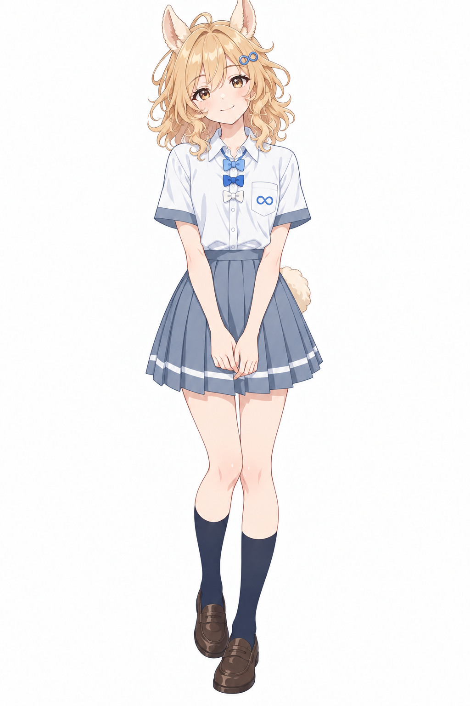 | 志喜屋梦子 | 公交站那位白皙长发、睡眼惺忪的女生 | **Llama** | 蓬松蜂蜜金及肩卷发、奶油色羊驼耳、榛色眼、奶油色小尾巴、蓝色无限符号徽章 | 060 |
| 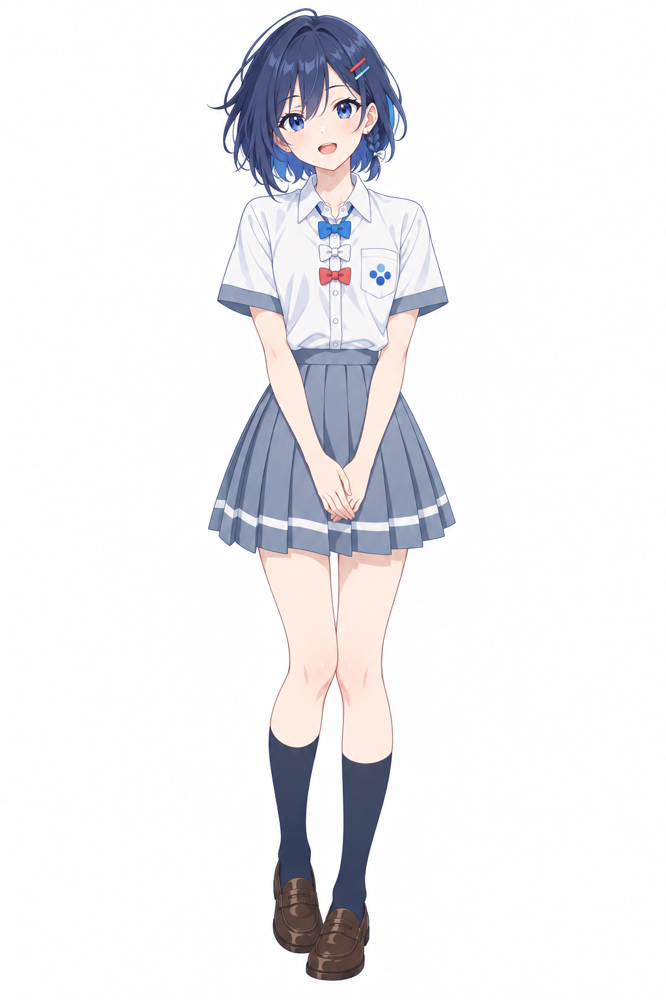 | 马剃天爱星 | 学生会，楼梯左侧较矮的深藏青短发女生 | **文心（ERNIE）** | 午夜蓝不对称波波头加细辫、红蓝成对发夹、蓝眼、蓝红白蝴蝶结 | 063 |
| 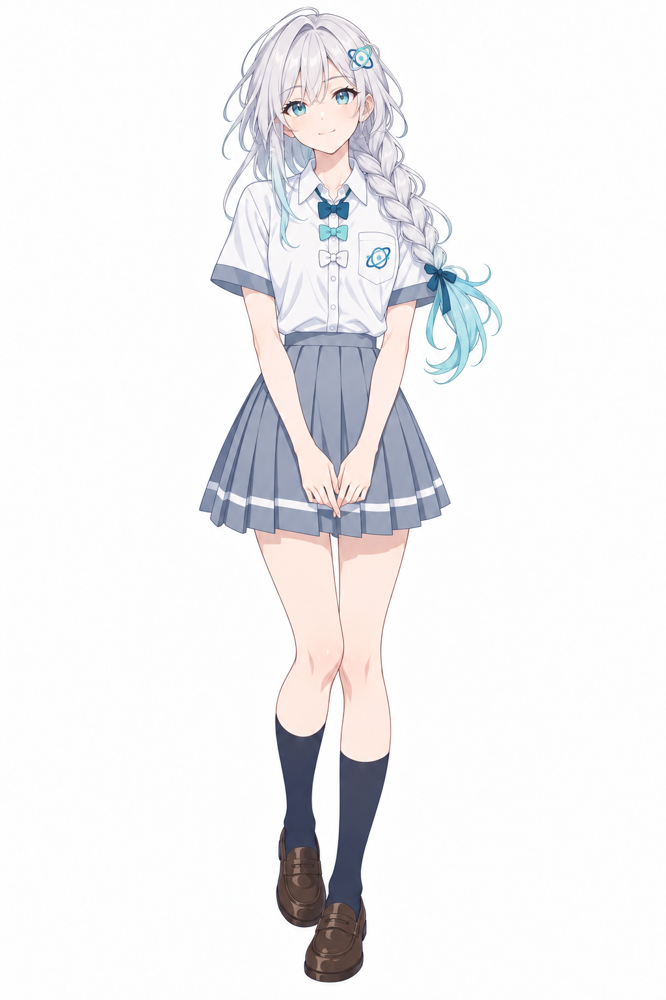 | 放虎原云雀 | 学生会长，很高、红色直长发（楼梯中间） | **混元** | 银白长侧辫发尾渐青、松石绿眼、轨道发夹、青蓝白蝴蝶结 | 063 |
| 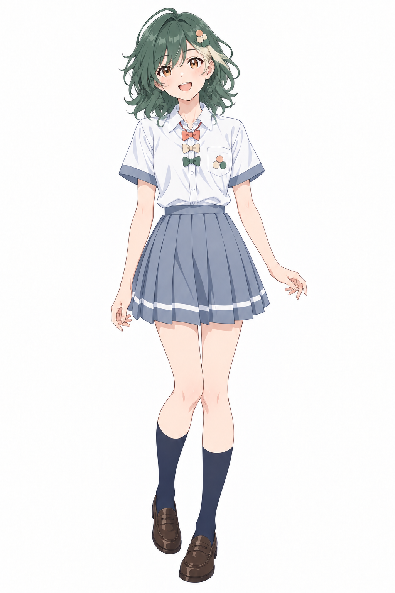 | 权藤アサミ | 佳树的同学，较高、棕色波波头 | **Cohere** | 及肩森林绿波浪发加一缕奶油色挑染、榛色眼、桃绿奶油色蝴蝶结 | 066 |
| 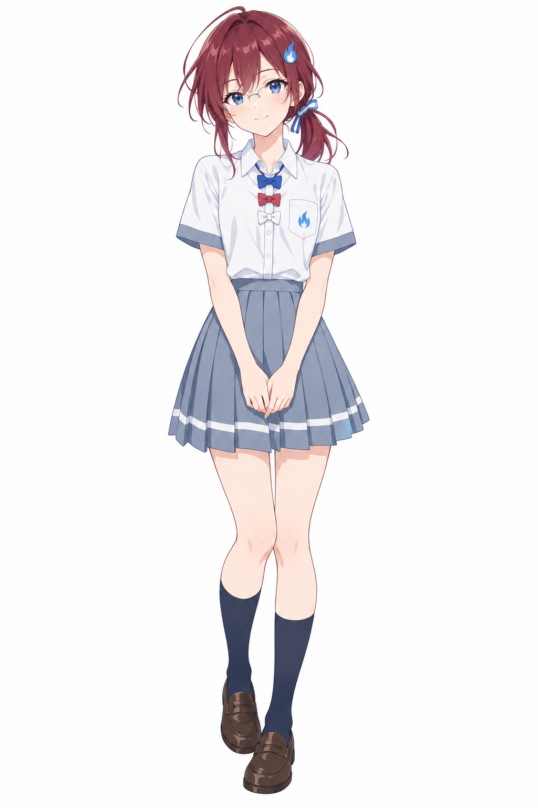 | 楼梯上看书的学生会成员 | 063 右侧远处坐着看书的红棕短发男生，只出场这一次 | **星火（Spark）** | 酒红低侧马尾、无框眼镜、蓝眼、蓝色火焰发夹、蓝红白蝴蝶结 | 063 |

## 逐镜身份判断

原计划的角色列表有几处和实际画面不符，以下是按画面修正后的最终结果：

| 镜头 | 画面里的情况 | 处理 |
|---|---|---|
| 038 | 动物园门口只有路人，没有主要人物 | 不换人，只换字幕 |
| 039、040 | 滑过地板、戴眼罩睡觉的都是甘夏老师 | 换成豆包 |
| 058 | 走廊尽头很小的男生是温水；三位女主都在场 | 男生换成 GPT，补上 Gemini |
| 032-033 | 六人从左到右是月之木、小鞠、玉木、温水、柠檬、八奈见；远景里的两个男生也要换 | Perplexity、Claude、GLM、GPT、Gemini、DeepSeek |
| 059 | 计划漏了柠檬，实际三位女主都在 | 补上 Gemini |
| 067 | 计划写的是温水，实际是八奈见（白连衣裙） | 换成 DeepSeek |
| 049-051 | 计划的角色是空的，实际有八奈见、柠檬、小鞠 | DeepSeek、Gemini、Claude |
| 053 | 只有裙摆和鞋，看不出是谁 | 按三位女主处理：DeepSeek、Gemini、Claude |
| 034、035 | 计划里的外观描述有误：朝云是棕色直长发（035 里穿黄色连衣裙），绫野是银灰发戴眼镜的男生（穿绿马甲） | 朝云 → Qwen，绫野 → Mistral |
| 063 | 左：马剃；中：放虎原（很高、红色长直发）；右边远处坐着看书的男生是只出场一次的角色 | 文心、混元、星火 |
| 073 | 撑黄伞的人脸在阴影里，深色短发、条纹毛衣 | 按柠檬换成 Gemini |

## 演职人员署名对照

只换姓名，职位标签和版式保留。原片里写着 `(A-1 Pictures)` 的所属行，改成此人所在的 AI 公司。

| 镜头 | 职位 | 原名 | 替换为 |
|---|---|---|---|
| 004 / 007 / 009 | 角色名字卡 | — | DeepSeekちゃん / Geminiちゃん / Claudeちゃん |
| 014_015–018 | 片名 | 負けヒロインが多すぎる！ | 負けAIが多すぎる！（英文副标题 too many losing AIs） |
| 021-022 | 原作 | 雨森たきび | Geoffrey Hinton |
| 023 | キャラクター原案 | いみぎむる | Fei-Fei Li |
| 024-026 | 企画 | （7 位） | Sam Altman / Elon Musk / 梁文锋 / Sundar Pichai / Dario Amodei / Jensen Huang / Mark Zuckerberg |
| 027 | シリーズ構成 | 横谷昌宏 | Yann LeCun |
| 028-029 | キャラクターデザイン | 川上哲也 | Ilya Sutskever (SSI) |
| 028-029 | サブキャラクターデザイン | 齋藤悠 | Demis Hassabis (Google DeepMind) |
| 031 | メインアニメーター | 三浦琢光 / 竹田茜 / 原島未来 | Andrej Karpathy (Eureka Labs) / Noam Shazeer (Google DeepMind) / Ashish Vaswani (Essential AI) |
| 032-033 | ビジュアルボード | 大谷監生 / 有原慧悟 | Fei-Fei Li / Saining Xie |
| 034 | プロップデザイン | 木藤貴之 | Andrej Karpathy |
| 035 | 色彩設計 | 村上彩夏 | Robin Rombach (Black Forest Labs)，拆成 Ro / bin / Rom / bach 四块跳动，和原片一样 |
| 038 | 美術監督 / 美術 | 畠山佑貴 / 草薙 | Alec Radford / Aditya Ramesh |
| 039 | 美術設定 / 美術ボード協力 | 平義樹弥 / 滕翀 | David Holz (Midjourney) / Patrick Esser |
| 040 | 3D監督 | 栗林裕紀 | Ben Mildenhall |
| 046 | 撮影監督 / 編集 | 宮脇洋平 / 廣瀬清志 | Tim Brooks (Google DeepMind) / tibo |
| 049-051 | オープニング・テーマ | つよがるガール feat. もっさ（ネクライトーキー） | つよがるガール feat. Mati Staniszewski |
| 049-051 | アーティスト名 / 作詞・作曲・編曲 | ぼっちぼろまる | Mikey Shulman |
| 049-051 | 主題歌協力 | 飯塚知佐子 / 飯山沙稀 | David Ding |
| 052 | 音楽 / 音楽制作 | うたたね歌菜 / アニプレックス | Mikey Shulman / AI School Sound |
| 058 | 音楽ディレクター / 音楽プロデューサー | 安谷屋光生 / 山内真治 | Mati Staniszewski / David Ding |
| 059 | 音響監督 / 音響効果 | 吉田光平 / 長谷川卓也 | Alex Graves / Aaron van den Oord |
| 060 | プロデューサー | 神宮司学 | Dario Amodei |
| 061 | プロデューサー | 井上めぐみ | Elon Musk |
| 062 | プロデューサー | 大和田智之 / 長嶺利江子 | Arthur Mensch / 吴泳铭 |
| 063 | 原作協力 | 岩浅健太郎 / 星野博規 | 李彦宏 / 马化腾 |
| 064 | 制作統括 | 清水暁 / 佐藤成俊 | 唐杰 / Aravind Srinivas |
| 065 | アニメーションプロデューサー / 制作デスク | 菊池雄一郎 / 伊藤裕太郎 | 张一鸣 / Satya Nadella |
| 066 | アニメーション制作 | A-1 Pictures | AI School Studio |
| 075 | 監督 | 北村翔太郎 | Yoshua Bengio |
| 084 | 製作 | マケイン応援委員会 | AI学園制作委員会 |

## 署名规则

- **学术地位对应职位地位**：图灵奖三巨头担任三个核心职位：原作 Geoffrey Hinton、监督 Yoshua Bengio、系列构成 Yann LeCun。
- **领域对应职位**：美术、色彩、3D、摄影这些画面职位，给做图像和视频生成的研究者；音乐、音响职位，给做 AI 音乐和语音的人；制片人、企划，给各家 AI 公司的负责人。
- **所属公司**：原片的 `(A-1 Pictures)` 改成此人所在的 AI 公司。
- **排版**：原片竖排的日文姓名，换成英文时顺时针转 90° 竖排；中文姓名保持正立。
- **名额**：画面上只有一个姓名位的，只放一个人（例如 046 编集只放 tibo）。
- 以上全部是致敬玩梗，与相关人士及公司无关。
